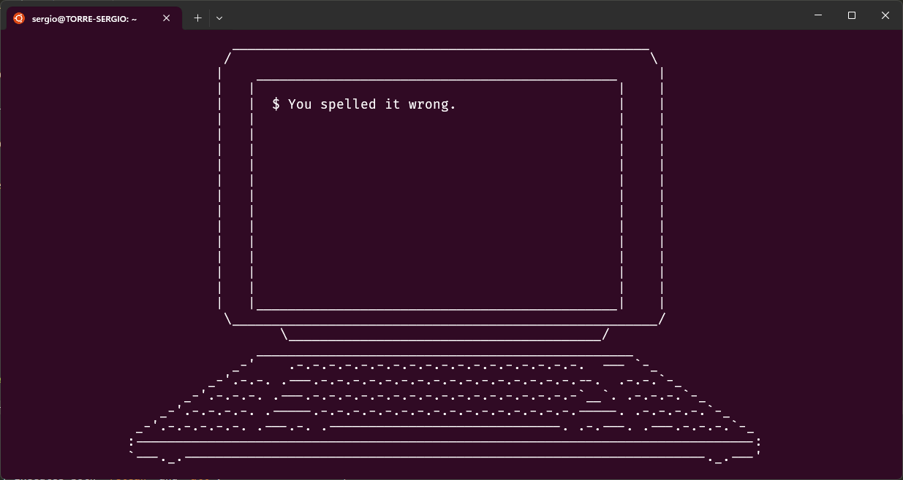

# PC(6) - Display animations aimed to correct users who accidentally enter pc instead of cp.



## Dependencies

- Debian/Ubuntu
```
sudo apt install make libncurses-dev
```

## Build and run

1. Clone the repository
```
git clone https://github.com/sdevsantiago/pc.git
```

2. Compile the project
```
cd pc
make && make clean
```

3. Run
```
./pc
```

4. Install
```
make install
pc
```

### Available flags

| Flag   | Description                                                    |
|--------|----------------------------------------------------------------|
| **-e** | Enables Ctrl+C to interrupt the program (disabled by default). |


## Makefile rules
| Rule          | Description                                         |
|---------------|-----------------------------------------------------|
| **all**       | Default rule, compiles the project.                 |
| **pc**        | Same as `all`.                                      |
| **clean**     | Removes all object files.                           |
| **fclean**    | Executes `clean` and removes binaries and packages. |
| **re**        | Executes both `fclean` and `all`.                   |
| **package**   | Executes `re` and creates the package.              |
| **install**   | Executes `package` and installs the package.        |
| **uninstall** | Purges/Uninstalls the package.                      |
